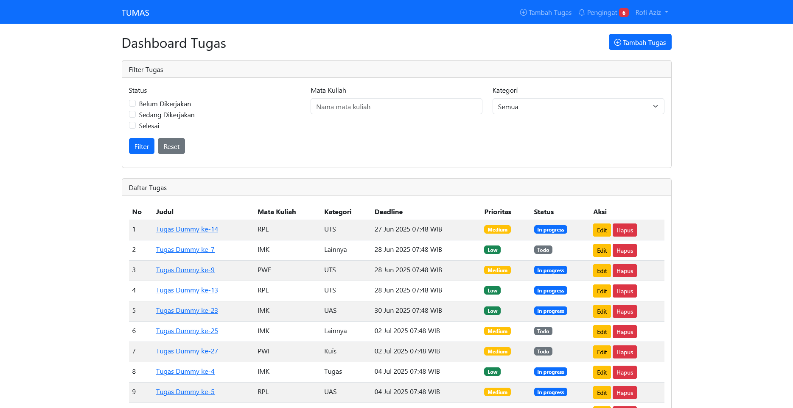

# Tumas - Task Management for Students



Tumas adalah aplikasi web manajemen tugas khusus mahasiswa yang dibangun dengan Laravel. Aplikasi ini membantu mahasiswa mengorganisir tugas kuliah dengan mudah, melacak tenggat waktu, dan mengelola prioritas tugas.

## Fitur Utama

-   🗓️ **Manajemen Tugas**: Tambah, edit, hapus, dan lihat detail tugas
-   ⏰ **Pengingat Deadline**: Notifikasi tugas yang mendekati deadline (3 hari sebelumnya)
-   🚨 **Tugas Terlambat**: Peringkat tugas yang sudah melewati deadline
-   📊 **Filter Tugas**: Filter berdasarkan status, mata kuliah, dan kategori
-   📁 **Kategori Tugas**: Kelompokkan tugas ke dalam kategori (Tugas, Kuis, UTS, UAS, Projek, Lainnya)
-   📈 **Prioritas**: Tandai tugas dengan prioritas (Rendah, Sedang, Tinggi)
-   🔐 **Autentikasi Pengguna**: Sistem login dan proteksi data per pengguna

## Teknologi

-   **Framework**: Laravel 10
-   **Database**: MySQL
-   **Frontend**: Bootstrap 5 + Blade Templates
-   **Tools**:
    -   Composer (Dependency Management)
    -   Artisan (Laravel CLI)
    -   Eloquent ORM

## Instalasi

1. Clone repositori:

    ```bash
    git clone https://github.com/username/tumas.git
    cd tumas
    ```

2. Install dependensi:

    ```bash
    composer install
    npm install
    ```

3. Buat file environment:

    ```bash
    cp .env.example .env
    ```

4. Generate key aplikasi:

    ```bash
    php artisan key:generate
    ```

5. Konfigurasi database di `.env`:

    ```env
    DB_DATABASE=nama_database
    DB_USERNAME=username
    DB_PASSWORD=password
    ```

6. Jalankan migrasi dan seeder:

    ```bash
    php artisan migrate --seed
    ```

7. Jalankan server:

    ```bash
    php artisan serve
    ```

8. Akses aplikasi di: [http://localhost:8000](http://localhost:8000)

## Struktur Proyek

```bash
tumas/
├── app/
│   ├── Http/Controllers/ # Controller aplikasi
│   ├── Models/           # Model database
│   └── ...
├── database/
│   ├── migrations/       # Skema database
│   └── seeders/          # Data dummy
├── resources/
│   ├── views/            # Template Blade
│   │   ├── tasks/        # Halaman tugas
│   │   ├── partials/     # Komponen UI
│   │   └── ...
│   └── ...
├── routes/               # Definisi rute
│   └── web.php
├── public/               # Aset publik
└── ...
```

## Kontribusi

Kontribusi dipersilakan! Ikuti langkah berikut:

1. Fork repositori
2. Buat branch fitur baru (`git checkout -b fitur-baru`)
3. Commit perubahan (`git commit -am 'Tambahkan fitur baru'`)
4. Push ke branch (`git push origin fitur-baru`)
5. Buat Pull Request

## Lisensi

Proyek ini dilisensikan di bawah [MIT License](LICENSE).

---

**Tumas** © 2023 - Aplikasi Manajemen Tugas untuk Mahasiswa  
Dibangun dengan ❤️ menggunakan Laravel
